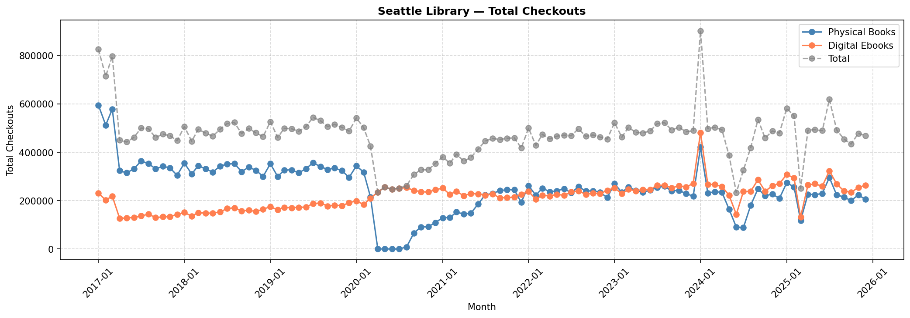
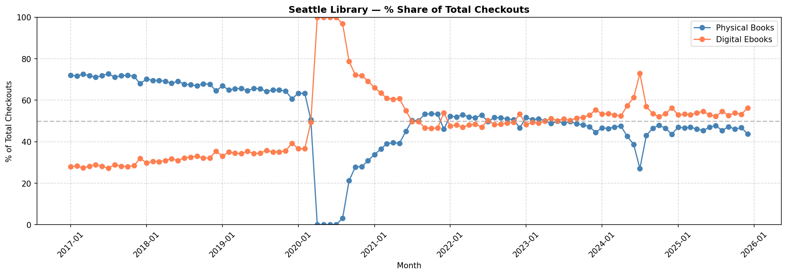
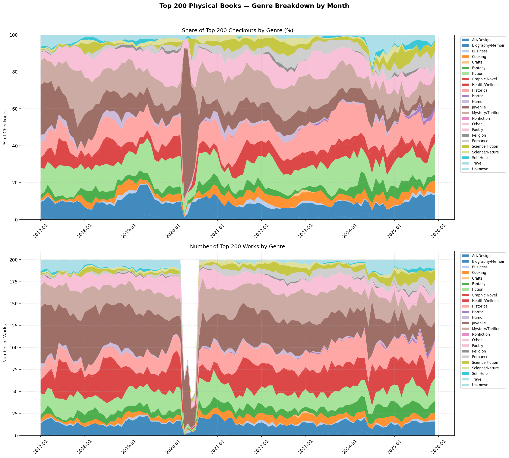
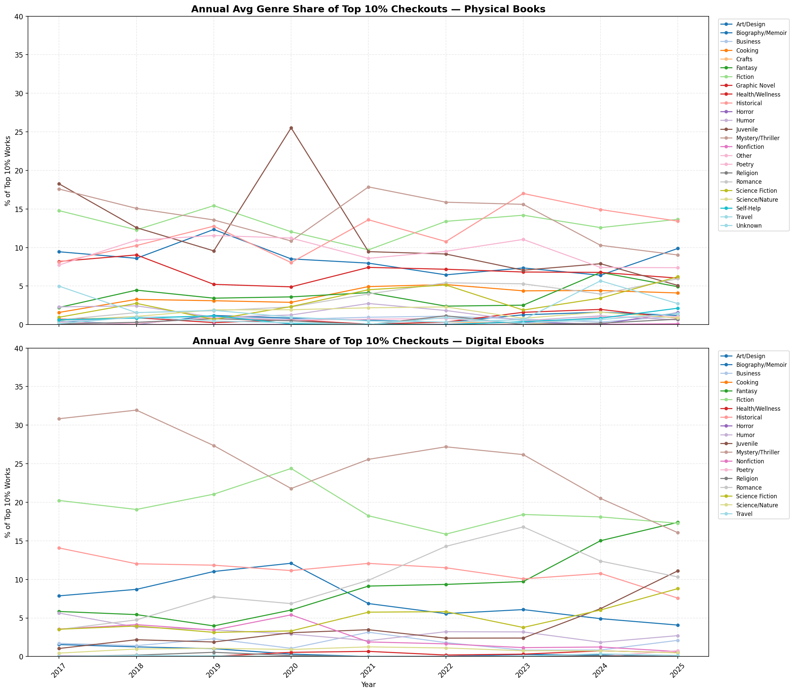
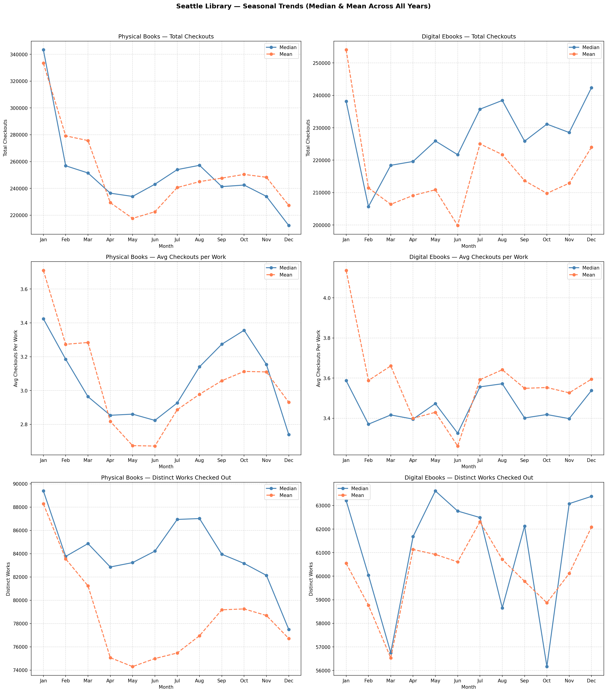
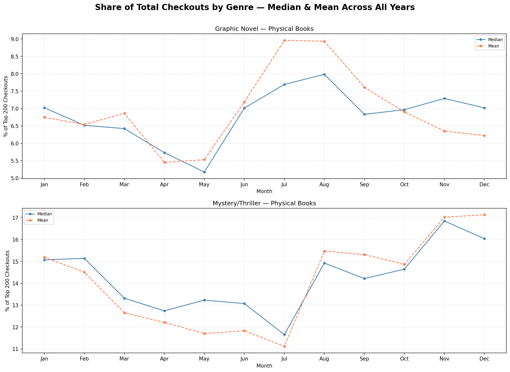
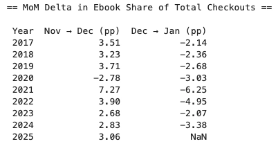
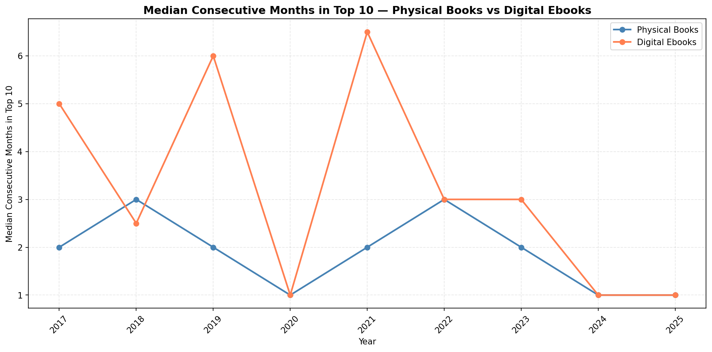
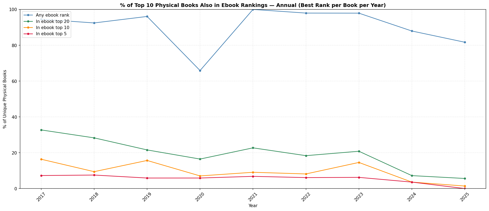

# How does Seattle read? Circulation Trends and Collection Recommendations

# Objective

Seattle Public Library circulation data covering more than 50 million checkouts between 2017 and 2025 show how reading habits have evolved across formats, genres, and seasons. This report supports the Library’s [2024-2033 Strategic Plan](https://www.spl.org/Seattle-Public-Library/documents/about-us/The%20Seattle%20Public%20Library%20Strategic%20Plan%202024-2033.pdf) to build an equitable and connected city by identifying how circulation patterns reflect community access and reading interests.

# Recommendations

1. Invest in collection development with a focus on equitable access
    - Expand digital Romance and Fantasy and entire Juvenile (physical and digital) genre collections to reflect growing patron interest since 2020 across the entire library system.  Further investigate branch-level circulation data to ensure growth reaches communities that need it the most.
    - Maintain growth in physical book collection - they still account for 46% of 2025 checkouts and serve patrons without home internet access, personal devices, or digital literacy skills.  Reducing the physical collection risks widening the access gap for these residents.
    - Physical checkouts span a broader range of genres than ebooks (23 genres vs. 17 in the top 10% of checkouts), reflecting a wider range of reader interests and cultural backgrounds. Maintaining that diversity supports the library's commitment to serving all communities.
    - Physical checkouts of books in the Juvenile genre held steady through COVID even as all other genres declined, signaling that physical libraries remains an essential reading resource for children.
2. Resource Allocation
    - July and August are the system's busiest months for both physical and digital checkouts. Staffing and operational capacity should be reviewed ahead of summer to serve patrons well during this period.
    - Ebook checkout share rises consistently in December and returns to baseline by January. Ebook licensing should account for this December increase rather than relying on annual averages.
    - As patron interest in specific titles shifts more quickly (a trend since 2023), pay-per-borrow ebook licensing offers a flexible alternative to fixed-term licenses for trending titles.
3. Patron Engagement Opportunities
    - July and August show measurable lifts in both checkout volume and genre variety. Further investment in branch-based children's programming during summer holidays could deepen literacy engagement.
    - March (National Reading Month) shows wider variety in physical book checkouts, suggesting patrons are open to discovery. Invest in branch programming, curated displays, and recommendations during this month.
    - Mystery/Thriller checkouts surge each November. Genre-specific reader's advisory programming and themed displays in October and November could support exploration and deepen engagement with these collections.

# Background

The Seattle Public Library system comprises of [27 branches](https://www.spl.org/using-the-library/get-started/get-started-in-english/en-get-started-at-library-branches#:~:text=We%20have%2027%20Library%20locations,staff%20for%20help%20or%20information.), directly serving [440,000 patrons](https://www.seattletimes.com/opinion/libraries-are-essential-seattles-library-levy-needs-to-reflect-that/) out of [800,000+](https://ofm.wa.gov/wp-content/uploads/sites/default/files/public/dataresearch/pop/april1/ofm_april1_population_final.pdf?ref=theurbanist.org) Seattle residents.  As of 2025, the system circulates an average 22,000 physical book checkouts across 68,000 unique titles, and 26,000 digital ebook checkouts across 66,000 titles.  Understanding what patrons read, and when, helps identify gaps in access and opportunities to better serve all communities.

# Format Trends, Reader Preferences, and Equitable Access

Physical book checkouts made up the majority of total book circulation in 2017 (72% of all checkouts), and had been slowly declining in favor of ebooks (64% by 2020), when COVID-19 accelerated the shift. Library closures in early 2020 pushed virtually all total checkouts to digital. When branches reopened in August 2020, physical checkouts recovered steadily, reaching parity with digital by July 2021. That balance held until September 2023, when digital checkouts began to consistent outpace physical.

However, Physical books still represent 46% of 2025 checkouts, and serve residents who lack reliable device or internet access, or are otherwise better served by local branch programming. The Library's [HotSpot lending program](https://www.spl.org/using-the-library/reservations-and-requests/reserve-a-computer/computers-and-equipment/spl-hotspot) confirms that digital access is a documented gap for a real portion of SPL patrons. Children are equally critical.  Physical juvenile checkouts held steady throughout COVID closures, even as every other genre collapsed, signaling that the library is an essential reading resource for many children who otherwise lack alternatives at home.

Genre patterns confirm that digital and physical formats serve patron communities with different interests. Physical book checkouts are broadly distributed across genres (the top 10% of physical checkouts spans 23 genres), and Fiction, Historical, and Biography/Memoir have held consistent top-three positions since 2017. By contrast, ebook checkouts are more concentrated: the top 10% spans 17 genres.  And while Mystery/Thriller and Fiction have remained mainstays, Romance, Fantasy, and Juvenile have emerged as growing genres since 2020, displacing previously popular Nonfiction and Biography/Memoir titles.

Because digital and physical collections are serving different reader communities, they should be treated as complements rather than substitutes when building collections. Shifting budget away from physical collections toward ebooks risks leaving significant patron populations without access to the library's resources.

**Recommendation:** Maintain genre diversity in physical collections. Expand digital Romance and Fantasy collections, and both digital and physical Juvenile collections, to reflect patron reading interests. Use branch-level circulation data to calibrate the physical/digital balance by community rather than applying a single system-wide approach.

# Seasonal Trends

Across all 8 years observed in the data, circulation follows consistent seasonal patterns that create predictable planning opportunities.

March, National Reading Month, increases the range of physical books checked out, which suggests that patrons are receptive exploring more titles in the collection, which can be encouraged by adding reader’s advisory programming during this time.

School holidays in July and August are peak circulation months for both digital and physical book formats.  Physical checkout growth comes from a wider range of titles being borrowed, suggesting that patrons are receptive to exploring more of the collection.  By contrast, digital checkout growth comes from the same number of titles circulating, but with faster turnaround time.

Physical checkouts of Graphic Novels peak circulation in July/ August, consistent with increased children's readership during school holidays. This is a natural moment for reader's advisory programming aimed at younger patrons. Investing further into the current Summer of Learning program with more reading challenges, staff picks lists highlighting graphic novel titles, and branch programming that celebrates children's reading interests can deepen literacy engagement and encourage young readers to explore more of the collection.

Physical Mystery/Thriller checkouts spike consistently each November. Branch programming such as themed displays, staff recommendation lists, and book discussion groups centered on Mystery/Thriller titles during October and November can encourage patrons to explore and engage more deeply their seasonal interest in the genre.

The holiday period produces a shift from physical to digital books. In every year except 2020, ebook checkout share rises in December and reverses in January. Excluding 2020, the December spike averages +3.3 percentage points from November, followed by a reversal of -2.8 percentage points in January. Because this shift is predictable and temporary, ebook licensing capacity should be planned against December increases rather than annual averages.

Recommendation: Review staffing and operational capacity ahead of July and August. Invest in branch programming during National Reading Month and consider genre-specific fall promotions around Mystery/Thriller. Plan ebook licensing against December circulation patterns.

# **Changing Popularity Tenure and Implications for Collection Strategy**

How long a title stays popular has changed substantially over time.  Historically, ebook titles in the monthly top 10 list by checkout volume stayed on that list for three to seven consecutive months.  Top 10 physical books cycled out faster, with titles holding their positions for one to three months.

Since 2024, turnover in the top 10 list has increased.  Top 10 ebook and physical book titles alike spend one month in the top 10 before dropping out.  

Additionally, the top 10 physical and digital lists have diverged.  Top physical book titles are increasingly different from top digital ebook titles, with overlap decreasing from 15% to 1% since 2023.

A likely explanation for this changed behavior is that social media recommendation platforms (BookTok, for example) spark brief but significant spikes in patron interest in specific titles. This shortening popularity tenure is more dramatic for ebooks than for physical books.  Ebooks are borrowed on the same devices where patrons access social media. Discovery and checkout happen in the same attention environment, so patron interest builds and fades quickly. By contrast, physical borrowing requires a deliberate trip to a branch and a mental shift that requires sustained interest that extends engagement with the book.

These changes directly affect how the library acquires ebooks.  The standard licensing model from publishers charges a fixed cost for a one to two year term.  Purchasing multiple licenses for a title that peaks in one month and then drops out of the top 10 entirely means paying for license capacity that goes unused for the remainder of its term.  A pay-per-borrow model where the library pays only when a patron checks out the title may be better matched to short, unpredictable surges in patron interest that fade quickly.  [SPL’s Peak Picks collection](https://www.spl.org/Seattle-Public-Library/documents/about-us/levy/reports/2025%20Q3%20Levy%20Report.pdf#page=11) is a flexible acquisition strategy for meeting interest in physical titles, so extending the same flexibility to digital licensing is a natural next step. 

Recommendation: Evaluate pay-per-borrow acquisition for ebooks, particularly for genre fiction where short popularity tenures are most pronounced. For physical books, which are less affected by these rapid swings, maintain the existing acquisition approach with a continued focus on genre diversity.

## Appendix

### Definitions

Throughout this report, *title* refers to a unique combination of title and author, and collapses across all editions included in the title (e.g., hardcover, paperback, large print). This is labeled *work* in the underlying analysis notebooks. The distinction matters because physical collections typically stock multiple editions of the same book, while digital catalogs carry only one. Analyzing at the title level would overstate the breadth of physical checkouts relative to digital.

### Methodology and Data Quality

Data Sources & Validation:

- Seattle Open Data Portal API (2017-2025)
- 8+ years, 22M+ circulation transactions
- Data quality processes:
    - Work-level deduplication (title + author normalization)
    - Genre classification validation

Limitations & Considerations:

- **Scope**: This analysis covers physical books and digital ebooks only. Audiobooks, DVDs, magazines, e-magazines, and all other material types are excluded. Findings should not be generalized to overall library circulation.
- Genre classifications subject to cataloging variation
- Digital checkouts may include renewals vs. unique borrows