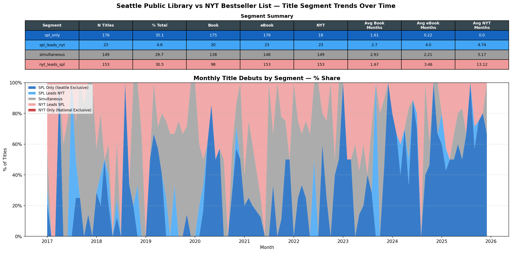
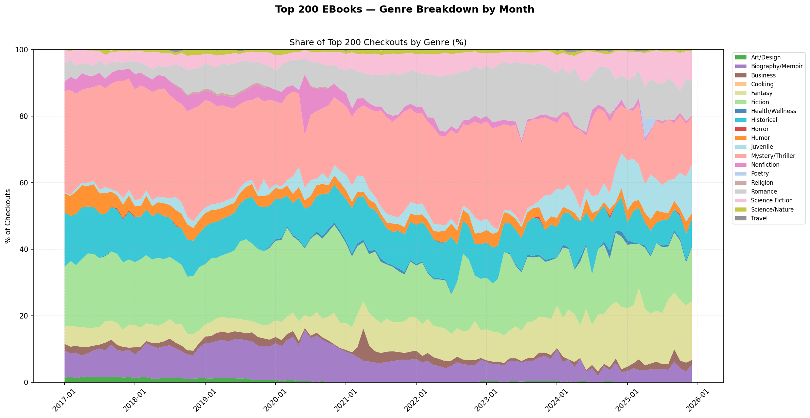
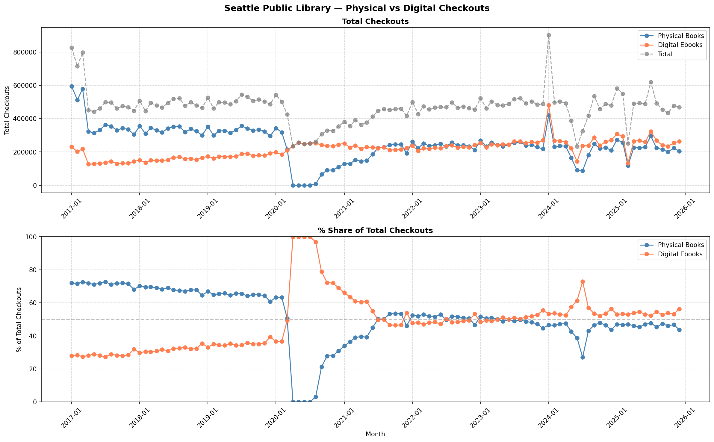
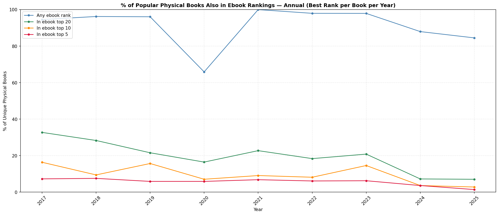
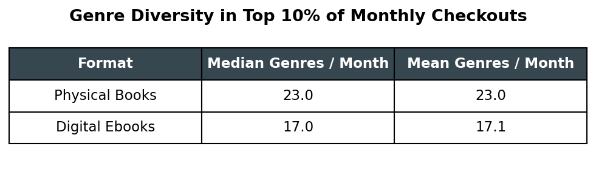
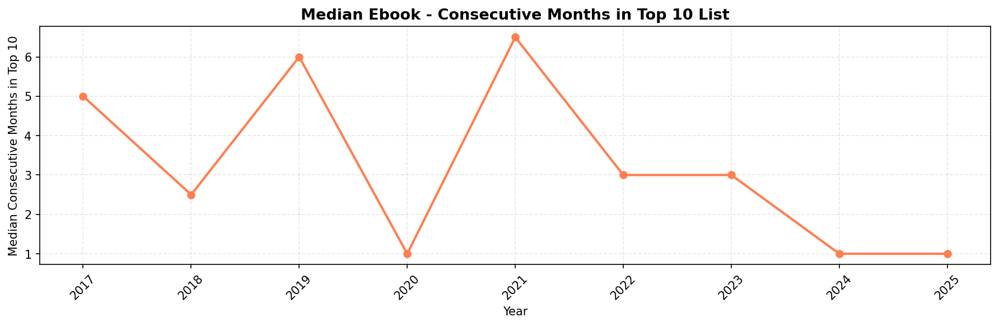
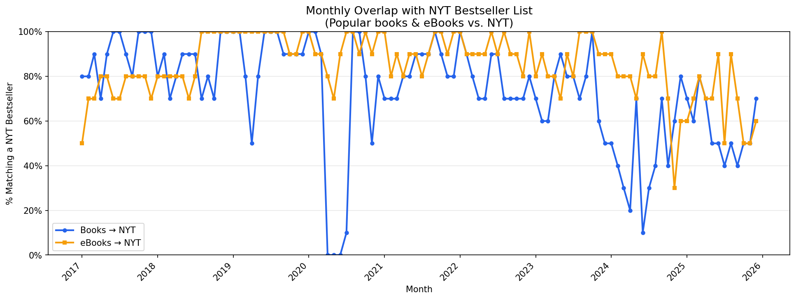

# Seattle, What are you Reading? Figures and Data

## Methodology
Dataset and Scope: Seattle Public Library [circulation data](https://data.seattle.gov/Community-and-Culture/Checkouts-by-Title/tmmm-ytt6) covering more than 50 million checkouts between 2017 and 2025 

## Definitions
**Title:** the unique combination of title and author, and collapses across all editions included in the title (e.g., hardcover, paperback, large print). This is labeled _work_ in the underlying analysis notebooks. This distinction matters because physical collections typically stock multiple editions of the same book, while digital catalogs carry only one. Analyzing at the title level would overstate the breadth of physical checkouts relative to digital.

**Popularity:** popular titles are those that make up the top 10% of monthly physical book or digital ebook checkout volume.

## Figures
**Figure 1:** 35% of popular SPL titles never show up on the NYT Bestseller List.  The remaining 65% of popular SPL titles also show up on the NYT Bestseller List - roughly half debut in the same month, and the other half debut on NYT Bestsellers ahead of becoming popular at SPL.

**Figure 2:** Genre Breakdown of popular digital titles.  Among ebook checkouts, Romance grew from 10% -> 24% in July 2023, Fantasy grew from ~7% to a peak of 22% in March 2025, displacing COVID genre leaders Nonfiction (19% in 2020, now <2%) and Biography/Memoir (15% in 2020, now ~5%)

**Figure 3:** COVID branch closures accelerated the shift of book checkouts from physical to digital.  Digital ebooks have made up the majority of checkout volume since September 2023.

Total monthly checkouts declined during COVID-19 library branch closures (March–August 2020) and physical checkouts declined to near zero. Digital checkout volume partially offset the loss but did not fully recover total checkout volume.Post-reopening recovery was gradual, with total combined checkout volume returning to pre-COVID levels by mid-2021. By 2023, total volume had stabilized and digital checkouts consistently exceed physical checkouts.

Physical books made up ~72% of total checkouts in 2017, declining slowly to ~64% by early 2020. COVID branch closures moved virtually all checkouts online to digital. After branches reopened in August 2020, physical checkouts recovered steadily, catching up with with digital by July 2021. Both formats remained roughly equal until September 2023, after which digital consistently exceeds physical checkouts. As of 2025, the split is approximately 46% physical / 54% digital.

**Figure 4:** Overlap in popular digital and physical titles have declined over time. Before 2023, 7% of the most popular physical titles by checkout volume were also reflected in the most popular ebook titles.  Since then, that overlap has dropped to 3%. 

**Figure 5:** Popular ebooks are more concentrated in genre than popular physical books.  Popular physical titles by checkout volume are spread across 23 distinct genres, and popular digital titles are made up of 17 genres.

**Figure 6:** Ebook popularity cycles are getting shorter.  In 2017, the median ebook spent 5–7 consecutive months in the most popular list. By 2024, the median ebook only spends 1 month in the most popular list before being replaced by other titles.

**Figure 7:** The NYT Bestseller list has more overlap with popular ebooks than popular physical books.  This has been consistent over time, suggesting that ebook borrowing preferences closer reflect commercial tastes captured in the NYT Bestseller List than physical books.

[Full analysis](https://github.com/auwng/data-portfolio/blob/main/projects/seattle-checkouts/analyses%20and%20outputs/reading_trends/analysis.ipynb/)

